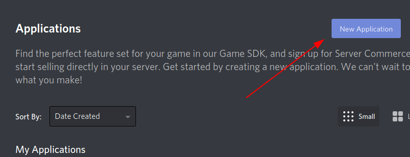
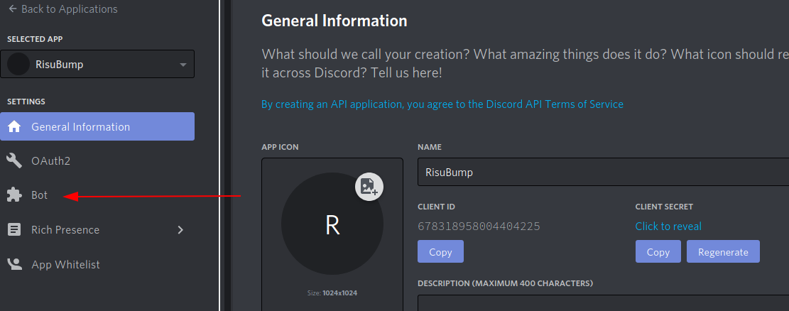
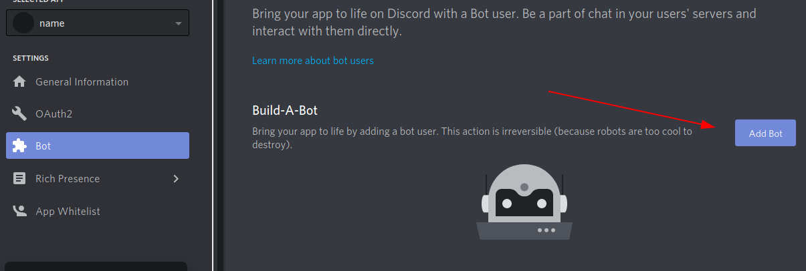
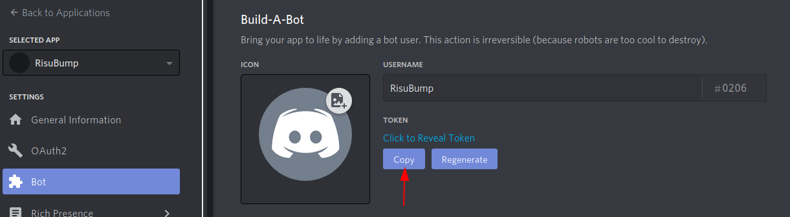

# RisuBotProject
This is a free and open source discord bot designed for server owners to advertise their server.

## Setup
Make sure to paste your token and prefix into RisuBump/bot/config.json
### To get a key
1. go [here](https://discord.com/developers/applications)
2. select the application you want to use or hit New Application 

3. select bot

4. create the bot if you haven't done so already

5. Now just copy the token
